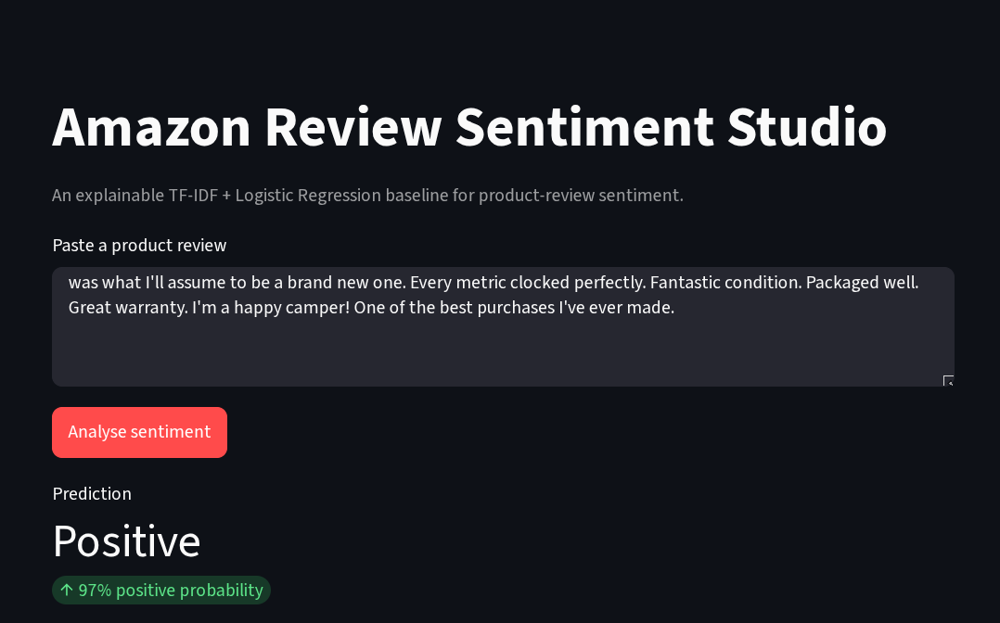

# Amazon Review Sentiment Studio

This project predicts whether an Amazon product review is positive or negative. It started as a Jupyter Notebook experiment and was later organised into a small machine-learning project with a web app.

**Live app:** [amazon-review-sentiment-studio.streamlit.app](https://amazon-review-sentiment-studio.streamlit.app/)

## App preview



## What it does

The dataset contains 25,000 reviews and their star ratings. Reviews with ratings from 1 to 3 are treated as negative, while ratings 4 and 5 are treated as positive. The model reads the review text and predicts one of these two classes.

For example:

- “The product arrived quickly and works perfectly.” → Positive
- “Poor quality and stopped working after two days.” → Negative

## How the model works

1. Read the review text and rating from `AmazonReview.csv`.
2. Remove missing or invalid records and clean extra whitespace.
3. Convert ratings into positive and negative labels.
4. Use TF-IDF to convert words and short phrases into numbers.
5. Train a Logistic Regression model on those features.

The model uses both single words and two-word phrases. This helps it recognise phrases such as “very good” or “not worth”.

## Result

Using an 80/20 train-test split with a fixed random seed, the model achieved **81.94% accuracy** on 5,000 test reviews.

This is a traditional NLP baseline. It is useful for learning and for quick review analysis, but it can still struggle with sarcasm, mixed opinions, and reviews that lack enough context.

## Tech used

- Python
- pandas
- Scikit-learn
- TF-IDF Vectorizer
- Logistic Regression
- Streamlit
- GitHub Actions

## Project files

```
AmazonReview.csv                              # Dataset
Amazon_Product_Reviews_Sentiment_Analysis.ipynb  # Original notebook work
app.py                                        # Streamlit web app
src/amazon_sentiment/                         # Training and model code
tests/                                        # Basic tests
```

The notebook is kept to show the original analysis. The Streamlit app uses the reusable code inside `src/amazon_sentiment`.

## Run it locally

```bash
git clone https://github.com/harshkamble14062002/Amazon-Product-Reviews-Sentiment-Analysis.git
cd Amazon-Product-Reviews-Sentiment-Analysis
python -m venv .venv
source .venv/bin/activate
pip install -r requirements.txt
PYTHONPATH=src streamlit run app.py
```

On the first run, the app trains the model from the included CSV file. After that, it reuses the saved model.

## License

The code is available under the [MIT License](LICENSE). Check the source and redistribution rights of the dataset before using it in another project.
