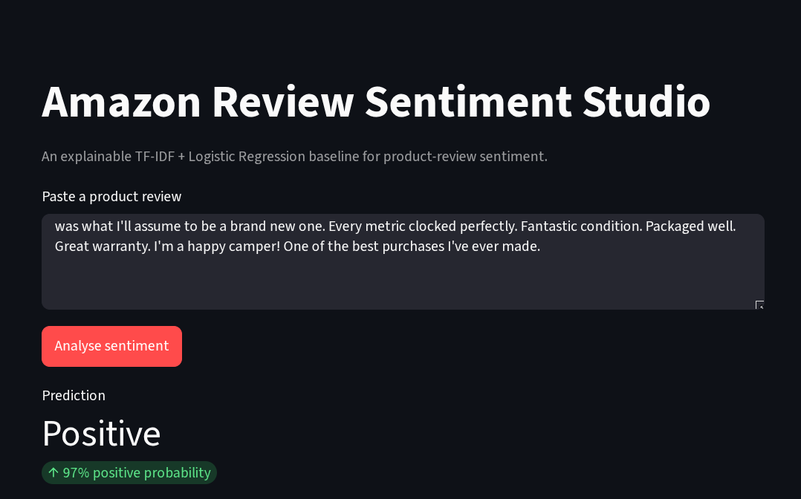

# Amazon Product Reviews Sentiment Analysis

A real-time sentiment analysis project for product reviews.

The project started as a normal machine-learning classifier using **TF-IDF + Logistic Regression**. I later extended it into a real-time pipeline using **FastAPI, Kafka, Spark Structured Streaming, PostgreSQL, Redis, Streamlit, and Docker**.

The main goal is simple:

- user submits a review
- FastAPI sends it to Kafka
- Spark reads the event and runs the ML model
- prediction is stored in PostgreSQL
- Redis keeps counters and latest values
- the user sees the sentiment result
- an admin dashboard shows recent activity and statistics

---

## Live AWS Deployment

The current Docker Compose stack is deployed on an AWS EC2 instance.

- **User App:** http://3.109.108.8:8501
- **Admin Dashboard:** http://3.109.108.8:8502


---

## Screenshots




---

## Model

The dataset contains around 25,000 Amazon product reviews.

Ratings are converted into two classes:

```text
1, 2, 3 stars -> Negative
4, 5 stars    -> Positive
```

The model uses:

```text
TF-IDF Vectorizer
        +
Logistic Regression
```

Current test result:

```text
Accuracy: 81.94%
Macro F1: 81.35%
```

The model is intentionally simple. Most of the work in this version of the project is around building the real-time processing pipeline around it.

---

## Architecture

```text
User
  |
  v
Streamlit User App
  |
  v
FastAPI
  |
  v
Kafka
  |
  v
Spark Structured Streaming
  |
  v
TF-IDF + Logistic Regression
  |
  +-------------------+
  |                   |
  v                   v
PostgreSQL           Redis
  |
  v
Admin Dashboard
```

### What each part does

- **Streamlit User App** - lets a user enter a review and see the prediction
- **FastAPI** - accepts reviews and publishes them to Kafka
- **Kafka** - holds incoming review events
- **Spark Structured Streaming** - consumes Kafka events and runs inference
- **PostgreSQL** - stores processed reviews permanently
- **Redis** - stores counters, latest sentiment values, and processed-event markers
- **Admin Dashboard** - shows review counts, sentiment distribution, and recent results
- **Docker Compose** - starts the complete stack

---

## Applications

### User App

```text
http://localhost:8501
```

A user enters only the review text.

Example:

```text
This phone has excellent battery life and the display is very good.
```

The app waits for the Kafka/Spark pipeline to finish and then shows:

```text
Sentiment: Positive
Confidence: 92.74%
```

### Admin Dashboard

```text
http://localhost:8502
```

The dashboard shows:

- total reviews
- positive reviews
- negative reviews
- sentiment distribution
- positive/negative rate
- recent processed reviews
- backend status

### FastAPI Docs

```text
http://localhost:8000/docs
```

Main endpoints:

| Method | Endpoint | Purpose |
|---|---|---|
| GET | `/health` | API health check |
| POST | `/reviews` | Submit a new review |
| GET | `/reviews` | List processed reviews |
| GET | `/reviews/{review_id}` | Get one processed review |
| GET | `/stats` | Get sentiment counters |

---

## Project Structure

```text
Amazon-Product-Reviews-Sentiment-Analysis/
|
├── artifacts/
|   └── sentiment_pipeline.joblib
|
├── scripts/
|   └── smoke_test.sh
|
├── sql/
|   └── init.sql
|
├── src/
|   └── amazon_sentiment/
|       ├── api.py
|       ├── data.py
|       ├── model.py
|       ├── train.py
|       |
|       ├── frontend/
|       |   ├── user_app.py
|       |   └── admin_dashboard.py
|       |
|       └── pipeline/
|           ├── producer.py
|           ├── database.py
|           ├── cache.py
|           └── spark_inference.py
|
├── tests/
|   ├── test_data.py
|   └── integration/
|
├── Dockerfile
├── Dockerfile.frontend
├── Dockerfile.spark
├── compose.yaml
├── requirements.txt
├── requirements-spark.txt
└── README.md
```

---

## Run Locally

### 1. Clone the repository

```bash
git clone https://github.com/harshkamble14062002/Amazon-Product-Reviews-Sentiment-Analysis.git
cd Amazon-Product-Reviews-Sentiment-Analysis
```

If the real-time pipeline is still on the feature branch:

```bash
git checkout feat/realtime-data-pipeline
```

### 2. Create a virtual environment

```bash
python -m venv .venv
source .venv/bin/activate
```

### 3. Install Python dependencies

```bash
pip install -r requirements.txt
```

### 4. Train the model

```bash
PYTHONPATH=src python -m amazon_sentiment.train
```

The model file should be created at:

```text
artifacts/sentiment_pipeline.joblib
```

### 5. Start the complete system

```bash
docker compose up -d --build
```

### 6. Check containers

```bash
docker compose ps
```

Expected services:

```text
amazon-reviews-kafka
amazon-reviews-postgres
amazon-reviews-redis
amazon-reviews-api
amazon-reviews-spark
amazon-reviews-user-ui
amazon-reviews-admin-dashboard
```

---

## Ports

| Service | Port |
|---|---:|
| User UI | 8501 |
| Admin Dashboard | 8502 |
| FastAPI | 8000 |
| Kafka | 9092 |
| PostgreSQL | 5433 |
| Redis | 6379 |

Inside Docker, services communicate using Docker service names such as:

```text
kafka:19092
postgres:5432
redis:6379
```

---

## End-to-End Test

The repository contains a smoke test for the complete pipeline.

Run:

```bash
bash scripts/smoke_test.sh
```

A successful run looks like:

```text
1. Checking API...
API OK

2. Sending review...
Review sent

3. Waiting for Spark result...
PostgreSQL result: Positive

4. Checking Redis...
Redis result: Positive

====================================
END-TO-END PIPELINE TEST PASSED
====================================

FastAPI -> Kafka -> Spark -> ML
                   -> PostgreSQL
                   -> Redis
```

This checks the real flow instead of calling the model directly.

---

## Tests

Run unit tests:

```bash
PYTHONPATH=src pytest tests/test_data.py -v
```

Run integration tests:

```bash
PYTHONPATH=src pytest tests/integration -v
```

Run everything:

```bash
PYTHONPATH=src pytest -v
```

---

## Useful Commands

Start the stack:

```bash
docker compose up -d
```

Rebuild and start:

```bash
docker compose up -d --build
```

Check status:

```bash
docker compose ps
```

Spark logs:

```bash
docker compose logs spark -f
```

API logs:

```bash
docker compose logs api -f
```

Stop containers:

```bash
docker compose down
```

Avoid this unless you intentionally want to delete persistent data:

```bash
docker compose down -v
```

The project uses Docker volumes for Kafka, PostgreSQL, Redis, and Spark checkpoints.

---

## Tech Stack

- Python
- pandas
- scikit-learn
- TF-IDF
- Logistic Regression
- FastAPI
- Apache Kafka
- Apache Spark
- Spark Structured Streaming
- PostgreSQL
- Redis
- Streamlit
- Docker
- Docker Compose
- pytest
- GitHub Actions

---

## CI

GitHub Actions currently checks:

```text
install dependencies
        |
train model
        |
run unit tests
        |
validate Docker Compose
        |
build containers
        |
start services
        |
run integration tests
        |
run smoke test
```

---

## Current Status

The complete pipeline is working locally with Docker Compose.

Verified flow:

```text
FastAPI -> Kafka -> Spark -> ML -> PostgreSQL
                             -> Redis
```

Both Streamlit applications are also running through Docker.

The next step for this project is deploying the same stack to a Linux/cloud server and exposing the web applications over HTTPS.

---

## Limitations

This is still a traditional sentiment model, so it may struggle with:

- sarcasm
- mixed opinions
- very short reviews
- product-specific context

The current focus is more on the real-time ML system design than on building a state-of-the-art NLP model.

---

## Future Work

Some useful next improvements:

- cloud deployment
- HTTPS and reverse proxy
- authentication for the admin dashboard
- Prometheus and Grafana monitoring
- model versioning
- MLflow
- PostgreSQL backups
- dead-letter handling for failed events
- Kubernetes deployment
- transformer-based sentiment model

---

## License

This project is available under the MIT License.

Check the source and redistribution rights of the dataset before reusing the dataset.

---

## Author

Harsha Kamble

GitHub:

```text
https://github.com/harshkamble14062002
```

Repository:

```text
https://github.com/harshkamble14062002/Amazon-Product-Reviews-Sentiment-Analysis
```
